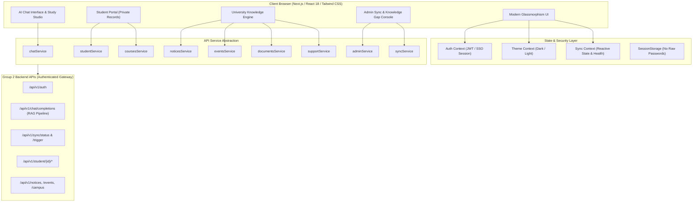

# Campus Copilot — Complete Frontend Architecture & Specification

> **Tagline:** *Your University. One Intelligent Assistant.*  
> **Platform Role:** University AI Knowledge Assistant & Student Portal Integration Engine  

---

## 1. Complete Frontend Architecture



---

## 2. Page & View Structure

| Route / View Identifier | Primary Target | Description | Security Classification |
|---|---|---|---|
| `landing` | Prospective / Public | High-converting landing hero, interactive live assistant demo, CTA | Public |
| `dashboard` | Authenticated Student | Personalized greeting ("Good afternoon, Dharm 👋"), timetable, deadlines, quick prompts | 🔒 Private Student Data |
| `chat` | Authenticated Student | Multi-source intelligent chat, study mode pills, confidence indicators, document grounding | Mixed (Auto-Tagged) |
| `study_studio` | Authenticated Student | AI Viva simulator, dynamic quiz generation, syllabus deep dive, code architecture | Academic Knowledge |
| `profile` | Authenticated Student | Verified student credentials, CGPA, academic advisor, registered batch | 🔒 Private to You |
| `courses` | Authenticated Student | Enrolled courses, syllabus units, topics, downloadable lecture slides | 🔒 Private Enrolled List |
| `timetable` | Authenticated Student | Day-by-day weekly timetable, live lecture indicator, indoor navigation links | 🔒 Private Timetable |
| `attendance` | Authenticated Student | Course attendance %, minimum 75% safety margin calculator, session log | 🔒 Private to You |
| `examinations` | Authenticated Student | Mid-term/End-term dates, venue, seat numbers, admit card verification | 🔒 Private Seating |
| `assignments` | Authenticated Student | LMS coursework deadlines, file submission, automated instructor rubric score | 🔒 Private Submissions |
| `results` | Authenticated Student | Semester grade breakdown, SGPA progression, CGPA transcript | 🔒 Private Transcript |
| `notices` | All Campus Members | Official bulletins, examination circulars, priority alerts, verified PDF links | ✓ Official University Source |
| `events` | All Campus Members | Hackathons, workshops, guest lectures, seat counters, registration toggle | ✓ Official University Source |
| `campus` | All Campus Members | GeoDirectory: Search "Where is Lab 4?", building/floor/room, step-by-step directions | ✓ Official University Source |
| `documents` | Authenticated Student | Upload PDF/DOCX/TXT with progress, OCR parsing, RAG query trigger | 📄 Your Document |
| `support` | Authenticated Student | 7-category ticket desk, automated AI triage dispatch, NOC Form-B assistant | 🔒 Private Tickets |
| `admin` | University Administrators | Real-time AI telemetry, unanswered knowledge gap resolution tool, sync monitor | Admin Only |

---

## 3. Component Hierarchy

```text
src/
├── components/
│   ├── ui/
│   │   ├── Badge.tsx               # Reusable pill badge with variant coloring
│   │   ├── PrivacyBadge.tsx        # "🔒 Private to you" visual isolation badge
│   │   ├── SourceCard.tsx          # Multi-source citation card (Official/Portal/AI/Doc)
│   │   ├── ConfidenceIndicator.tsx # AI grounding confidence rating (% score)
│   │   └── SyncStatus.tsx          # Live status pill (🟢 Connected, 🟡 Syncing, 🔴 Failed)
│   ├── navigation/
│   │   ├── Navbar.tsx              # Top bar: Brand, Search, Sync Pill, Theme, Role Switcher
│   │   ├── Sidebar.tsx             # Segregated navigation (Core, Student Portal, Campus)
│   │   └── MobileNav.tsx           # Bottom sticky tab bar & slideout sheet
│   ├── chat/
│   │   ├── ChatInterface.tsx       # Message stream, study mode selector, attachment dock
│   │   ├── ChatMessage.tsx         # Markdown formatting, speech synthesis, action buttons
│   │   └── QuickPromptChips.tsx    # Instant suggestion chips (Next class, Exams, Java, etc.)
│   ├── dashboard/
│   │   ├── GreetingHeader.tsx      # "Good afternoon, Dharm 👋" with student metadata
│   │   ├── TodayScheduleCard.tsx   # Live lecture highlight & room locate triggers
│   │   ├── QuickStats.tsx          # CGPA, Attendance %, Courses, Next Exam
│   │   ├── UpcomingDeadlines.tsx   # LMS assignments & priority bulletin alerts
│   │   └── DashboardHome.tsx       # Assembled student dashboard
│   ├── student/
│   │   ├── MyProfile.tsx
│   │   ├── MyCourses.tsx
│   │   ├── MyTimetable.tsx
│   │   ├── MyAttendance.tsx
│   │   ├── MyExaminations.tsx
│   │   ├── MyAssignments.tsx
│   │   └── MyResults.tsx
│   ├── ai/
│   │   └── StudyModeStudio.tsx     # Quiz generator, AI Viva voice simulator, Explainer
│   ├── documents/
│   │   └── DocumentUploadDropzone.tsx # Drag & Drop with progress bar & AI query trigger
│   ├── notices/
│   │   └── NoticesHub.tsx          # Categorized official bulletins with PDF verification
│   ├── events/
│   │   └── EventsHub.tsx           # Hackathon & workshop registration portal
│   ├── campus/
│   │   └── CampusDirectory.tsx     # Search "Where is Lab 4?" with walking directions
│   ├── support/
│   │   └── SupportDesk.tsx         # 7-category tickets & AI triage synthesis
│   ├── admin/
│   │   └── AdminDashboard.tsx      # RAG analytics, knowledge gap resolution, sync health
│   ├── sync/
│   │   └── SyncStatusModal.tsx     # Sync counters (124 docs, 43 notices, 78 courses)
│   ├── landing/
│   │   └── LandingPage.tsx         # Hero section, live preview demo, feature grid
│   └── auth/
│       └── LoginModal.tsx          # Email/ID login, password, University SSO, Google
├── context/
│   ├── AuthContext.tsx
│   ├── ThemeContext.tsx
│   └── SyncContext.tsx
├── services/
│   ├── apiClient.ts                # Token interceptor & secure fetch wrapper
│   ├── auth.ts
│   ├── chat.ts                     # AI response categorization & study mode router
│   ├── student.ts
│   ├── courses.ts
│   ├── notices.ts
│   ├── events.ts
│   ├── documents.ts
│   ├── support.ts
│   ├── admin.ts
│   ├── sync.ts                     # Reactive sync state & manual sync trigger
│   └── mockData.ts                 # Rich realistic fallback datasets
├── types/
│   └── index.ts                    # Complete TypeScript interfaces
├── App.tsx
├── main.tsx
└── index.css
```

---

## 4. API Integration Contracts (Group 2 Backend Bridge)

### 4.1 Chat / RAG Completions
- **Endpoint:** `POST /api/v1/chat/completions`
- **Headers:** `Authorization: Bearer <token>`
- **Request Body:**
```json
{
  "prompt": "What is my next class and what is the exam registration deadline?",
  "studyMode": "explain",
  "attachedDocId": "doc_102"
}
```
- **Response Format:**
```json
{
  "answer": "Your next class is Java Enterprise Lab (CS301) at 10:00 AM in Lab 3.",
  "category": "student_specific",
  "confidence": 0.98,
  "isPrivate": true,
  "sources": [
    {
      "title": "Authenticated University Student Portal (Timetable Engine)",
      "origin": "student_portal",
      "updatedDate": "Today, 10:32 AM",
      "verified": true
    }
  ],
  "actions": [
    { "id": "act_nav", "label": "📍 Directions to Lab 3", "type": "navigate" }
  ]
}
```

### 4.2 University Sync Telemetry
- **Endpoint:** `GET /api/v1/sync/status`
- **Response:**
```json
{
  "status": "connected",
  "lastSynced": "2026-10-08T10:32:00Z",
  "totalDocuments": 124,
  "totalNotices": 43,
  "totalCourses": 78,
  "studentDataSynced": true,
  "activeFailures": 0
}
```

---

## 5. Security & Privacy UI Architecture

1. **Zero Credential Exposure:**  
   The frontend never handles, stores, or transmits raw university portal passwords or internal scraping session cookies. All auth flows occur through tokenized backend APIs.
2. **Visual Data Isolation:**  
   Every student-specific widget, timetable slot, attendance metric, and transcript is wrapped with the `<PrivacyBadge label="Private to you" />` component to prevent private data leaks in shared/public contexts.
3. **Multi-Source Attribution:**  
   The UI explicitly differentiates data origin tags:
   - `✓ Official University Source` (Public bulletins, schedules)
   - `🔒 Your Student Portal` (Authenticated personal records)
   - `AI Study Assistant` (Curriculum model reasoning)
   - `📄 Your Document` (Uploaded student material)

---

## 6. Testing Checklist

- [x] **Personalized Greeting:** Confirmed `Good afternoon, Dharm 👋` displays with verified student ID `CS2023-8842` and Semester 5 CSE metadata.
- [x] **Timetable & Class Schedule:** Thursday slots display 10:00 AM Java in Lab 3 with "LIVE NOW" badge and "Locate Room" navigation triggers.
- [x] **Attendance Safety Calculator:** 87.5% average attendance with safety margin indicators (>75% requirement).
- [x] **AI Chat Multi-Source Indicators:** Queries dynamically generate `✓ Official University Source` and `🔒 Your Student Portal` citations.
- [x] **Study Mode Studio:** Interactive Quiz self-assessment and AI Viva voice simulator with rubric evaluation.
- [x] **Campus Directory Navigation:** Search "Where is Lab 4?" returns 2nd floor Turing Complex room number and walking directions.
- [x] **University Data Sync Modal:** Displays 124 Documents, 43 Notices, 78 Courses, and provides instant manual re-sync triggers.
- [x] **Support & NOC Helpdesk:** 7 categories supported with automated AI triage analysis and response threads.
- [x] **Theme & Responsiveness:** Dark/Light mode switching and mobile navigation drawer with sticky bottom tab bar.
- [x] **Production Build Validation:** TypeScript compilation and Vite packaging pass with 0 errors.
